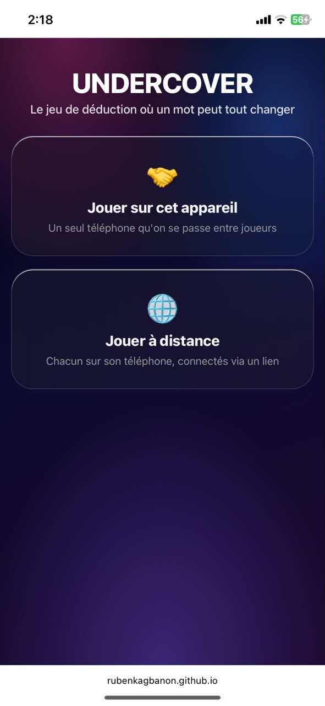

# Undercover

Undercover est un jeu de déduction et de bluff à jouer entre amis. Chaque joueur reçoit un mot secret : les Civils reçoivent tous le même mot, les Undercover reçoivent un mot proche mais différent, et Mr. White ne reçoit aucun mot et doit bluffer. À chaque manche, les joueurs décrivent leur mot à voix haute, discutent, puis votent pour éliminer un joueur — jusqu'à ce qu'un camp l'emporte.

## Fonctionnalités

- **Jouer sur un seul appareil** : un téléphone qu'on se passe entre joueurs.
- **Jouer à distance** : chacun sur son propre téléphone, connectés via un lien (WebRTC, sans compte).
- Paquets de mots par catégories, ou mots personnalisés.
- Options avancées : vote à voix haute ou anonyme, restrictions sur Mr. White, rôles visibles ou cachés.
- Suivi des scores sur plusieurs manches.

## Aperçu

## Jouer en ligne

👉 https://rubenkagbanon.github.io/Undercover-game/
